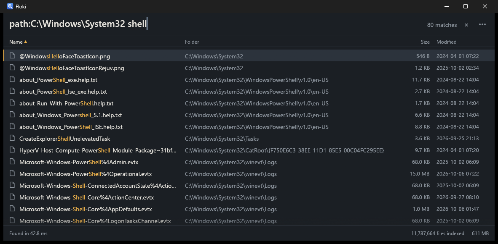

# Floki

Instant file-name search for Windows. Floki reads the NTFS Master File Table
directly, stays current from the change journal, and keeps every file name on
every drive in memory at about 55 MB per million files, so results appear
while you are still typing.

It is built in the spirit of [voidtools Everything](https://www.voidtools.com/)
(and uses the same query syntax), with a tighter budget for memory and CPU.
Floki is an independent project, not affiliated with voidtools.



## At a glance

Measured on a 16-core desktop with five drives (four NTFS, one ReFS Dev Drive):

| | |
|---|---|
| Files indexed | 11.8 million |
| Indexer memory | 630 MB (≈ 54 MB per million files) |
| `python`, 1,092,658 matches | 115 ms |
| Typing `p` → `python`, per keystroke | 38–128 ms |
| Rare terms, `wfn:notepad.exe`, `ext:` lists | under 50 ms |
| Indexer CPU while idle and following changes | ≈ 0.2 % |
| Full index load at startup | ≈ 2.5 s, no rescan |

## Features

- **Whole-drive search as you type.** Names, folders and paths across every
  NTFS and ReFS volume, with Everything-style syntax: AND / OR / NOT,
  wildcards, `ext:`, `path:`, `folder:`, `file:`, `regex:`, `case:`, `wfn:`.
- **No directory walking on NTFS.** The first index of a drive comes straight
  from the MFT; after that the USN change journal keeps it live, including
  while Floki was closed (the journal is replayed on start).
- **ReFS and Dev Drives.** ReFS has no MFT, so its first scan walks folders at
  background priority; after that it follows the change journal like NTFS.
- **A quiet indexer.** Runs at below-normal priority with background I/O for
  scans, never more than two searches at once, and refuses to stall: a sort
  that would have to read the disk for too many files says so instead.
- **A keyboard-first window.** Tray icon, global hotkey (`Ctrl+Alt+Space`),
  sortable columns, light and dark themes, sizes and dates read lazily for
  the rows on screen only.
- **A CLI** (`flk`) for scripts and pipelines.
- **An MCP server** so AI assistants such as Claude Code, Claude Desktop or
  Cursor can search your file names: over HTTP with a bearer token, or over
  stdio.

## Requirements

- Windows 10 or 11, NTFS or ReFS volumes.
- Administrator rights for the indexer (`flokid`), which reads the MFT and the
  change journal. The window and the CLI run as a normal user and talk to the
  indexer over a named pipe.
- To build: stable Rust 1.95 or newer with the MSVC toolchain.

## Download

Grab `floki-<version>-windows-x64.zip` from
[Releases](https://github.com/nikkoxgonzales/floki/releases), unzip it to a
folder you'll keep (for example `%LOCALAPPDATA%\Programs\Floki`), and continue
with [Getting started](#getting-started).

The binaries are built from the tagged source by GitHub Actions and are not
code-signed yet, so Windows SmartScreen may warn on first run (*More info* →
*Run anyway*) and the indexer's admin prompt shows an unknown publisher. To
check a download, compare it with `SHA256SUMS.txt` on the release, or verify
where it was built:

```sh
gh attestation verify floki-v0.1.0-windows-x64.zip --repo nikkoxgonzales/floki
```

## Build from source

```sh
git clone https://github.com/nikkoxgonzales/floki
cd floki
cargo build --release
```

This produces three programs in `target/release/`. Keep them in one folder;
the window looks for `flokid.exe` next to itself.

| Program | What it is |
|---|---|
| `flokid.exe` | The indexer. Runs elevated, holds the index, answers searches. |
| `floki.exe` | The search window, tray icon and hotkey. |
| `flk.exe` | The command-line client, and the MCP server over stdio. |

## Getting started

1. **Start the indexer.** From an elevated terminal:

   ```sh
   flokid install   # start it now and at every sign-in, no UAC prompt afterwards
   # or, for this session only:
   flokid run
   ```

   You can also skip this step: open `floki.exe` and click **Start indexer**
   or **Start it at every sign-in** on the panel it shows.

2. **Open the window** with `floki.exe`, or press `Ctrl+Alt+Space` once it is
   in the tray. The first index of a large NTFS drive takes a minute or so;
   results appear while it runs, and the status line says when they are
   still incomplete.

3. **Make it permanent** in Settings → General: turn on *Open Floki at
   sign-in* (tray only) and *Start the indexer at sign-in*.

Floki keeps its state in `%LOCALAPPDATA%\Floki\`: `index.bin` (saved every
ten minutes and on shutdown), `flokid.log`, and `mcp.json` once MCP is set up.

## Searching

Plain text matches anywhere in the **name**, ignoring case.

| Query | Finds |
|---|---|
| `report 2024` | names containing both words |
| `jpg\|png` | either word |
| `!tmp` | names without `tmp` |
| `"program files"` | the exact phrase, spaces included |
| `*.rs`, `rep?rt` | whole-name wildcards (`*` any run, `?` one character) |
| `ext:jpg;png;gif` | by extension |
| `path:projects\api` | text anywhere in the full path |
| `folder:node_modules` / `file:readme` | only folders / only files |
| `regex:^IMG_\d+` | a regular expression on the name |
| `case:README` | case-sensitive (stacks: `case:regex:^A`) |
| `wfn:notepad.exe` | the whole file name, exactly |
| `(jpg\|png) holiday` | grouping |

Click a column header to sort by it, and again to reverse. Date sorts start
with the newest. The index holds names only, so sorting by date reads each
match's dates from disk; past 200,000 matches Floki asks you to narrow the
search rather than spend minutes on it.

### Keyboard

| Key | Action |
|---|---|
| `Ctrl+Alt+Space` | show or hide Floki from anywhere |
| `↑` `↓` `PgUp` `PgDn` `Home` `End` | move through results |
| `Enter` / double-click | open |
| `Ctrl+Enter` | show in Explorer |
| `Ctrl+C` | copy the full path |
| `Del` | move to the Recycle Bin |
| `Shift+F10` / right-click | actions for the result |
| `F2` / `Ctrl+L` | back to the search box |
| `Ctrl+,` | Settings |
| `F1` | search syntax and shortcuts |
| `Esc` | clear the search, then hide to the tray |

## Command line

```sh
flk report                      # full paths, one per line
flk -n 20 -s path "*.toml"      # 20 results sorted by path
flk -l -s newest "*.log"        # long listing: modified (UTC), size, path
flk --stats python              # results, then match count and timings on stderr
flk --json "ext:pdf invoice"    # the raw JSON response
flk status                      # files, drives, memory, state
flk rescan C                    # rescan one drive (omit the letter for all)
flk shutdown                    # save the index and stop the indexer
```

Sorts: `name`, `path`, `modified`, `created`, each reversible with a leading
`-`; `newest` and `oldest` are shortcuts. Exit codes: `0` results found, `1`
no results, `2` indexer not running, `3` error.

## AI assistants (MCP)

Floki can serve its index to AI assistants over the
[Model Context Protocol](https://modelcontextprotocol.io/). Assistants get two
tools, `search_files` and `index_status`. Answers are compact text that keeps
token use low: a first line with the number of matches and the next page
offset, then one path per line, with runs of files in the same folder
grouped under it. Assistants see names, folders, sizes and dates, never file
contents.

**Over HTTP.** In Settings → MCP, turn on *Serve MCP while Floki is open*.
The endpoint is `http://127.0.0.1:7457/mcp`, reachable from this PC only
unless you choose *Other devices on my network too*. Every request needs the
bearer token shown on that tab (256 random bits, stored in `mcp.json`, can be
regenerated). The tab copies a ready-made setup command, for example:

```sh
claude mcp add --transport http floki http://127.0.0.1:7457/mcp \
  --header "Authorization: Bearer <token>"
```

The LAN option is plain HTTP, so use it only on networks you trust.

**Over stdio.** No port, no token, this PC only:

```sh
claude mcp add floki -- "C:\path\to\flk.exe" mcp
```

Either way the indexer must be running; the HTTP endpoint lives in the
window's process and runs while Floki is open or in the tray.

## How it works

1. **Scan.** `FSCTL_ENUM_USN_DATA` streams every MFT record in 1 MiB buffers
   into the index in batches, so results are searchable after the first
   batch. One drive scans at a time on a lowest-priority thread. ReFS
   volumes are walked folder by folder instead.
2. **Follow.** One thread per drive reads the USN journal every 750 ms and
   applies creates, deletes and renames under a short write lock. Journals
   are grown to 256 MB so a busy day doesn't wrap them; if one does wrap,
   that drive is rescanned in the background while the old data stays
   searchable.
3. **Store.** Each entry is 24 bytes (file reference, parent reference, name
   offset and length, flags) plus its name in a shared byte arena. Full
   paths are never stored; they are rebuilt by walking parent links, with
   per-folder caching during a search.
4. **Search.** Queries run in parallel over the arena on at most half the
   cores, with block-level presence bitmaps to skip regions that cannot
   match. Typing one more character searches inside the previous results.
   Nothing on the request path reads the disk while the index is locked.
5. **Serve.** `\\.\pipe\floki` speaks newline-delimited JSON; the window,
   `flk` and the MCP server are all clients of it.

## Resource budget

Floki treats these as hard limits; breaking one is a bug.

- **Idle:** 0 % CPU, under 2 % while following the journal.
- **Searching:** at most half the cores for one query, at most two queries
  in flight.
- **Scanning:** one enumeration thread at lowest priority, the whole process
  under about 25 % of total CPU.
- **Memory:** at most 60 MB per million files, flat over time.
- **No linear passes per request** beyond the search itself.

## Status

Early but in daily use. The index file format (`FLOKIDX2`) and the pipe
protocol are versioned but not yet frozen. Not supported yet: content
search, network drives, FAT/exFAT volumes, and Everything's IPC interface for
launcher plugins.

## Project layout

| Path | Contents |
|---|---|
| `crates/floki-core` | index and query engine; no Windows APIs, testable anywhere |
| `crates/floki-ntfs` | volume handles, MFT enumeration, journal reading, file metadata |
| `crates/floki-service` | `flokid`: scanning, live updates, persistence, pipe server |
| `crates/floki-proto` | pipe protocol types and framing |
| `crates/floki-ui` | `floki`: egui window, tray, hotkey |
| `crates/floki-cli` | `flk` |
| `crates/floki-mcp` | MCP server: JSON-RPC, HTTP transport, compact result text |
| `crates/floki-bench` | offline benchmark over a saved `index.bin` |
| `docs/` | architecture contract and research notes |

```sh
cargo test --workspace
cargo clippy --workspace --all-targets -- -D warnings
```

## License

[MIT](LICENSE)
